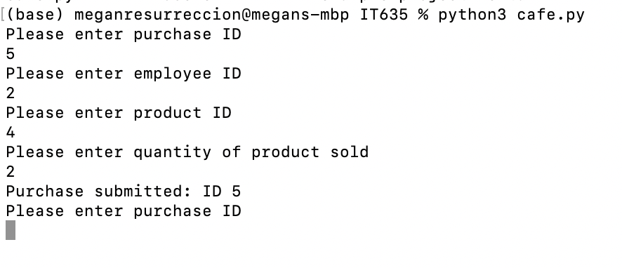

# IT635_Midterm
### Megan Resurreccion
This is the repository for the IT 635 Midterm Project. To test the database, download the .sql and .py files. Use pg_dump to add the data within the .sql file to postgres/local host. This should create the database in postgres and insert values while also granting all privileges to a role: cafe_user. With that role, you can run the .py file in the terminal and enter id values and insert the entity to the database. Running the Python file successfully and entering a new record would look like this:

